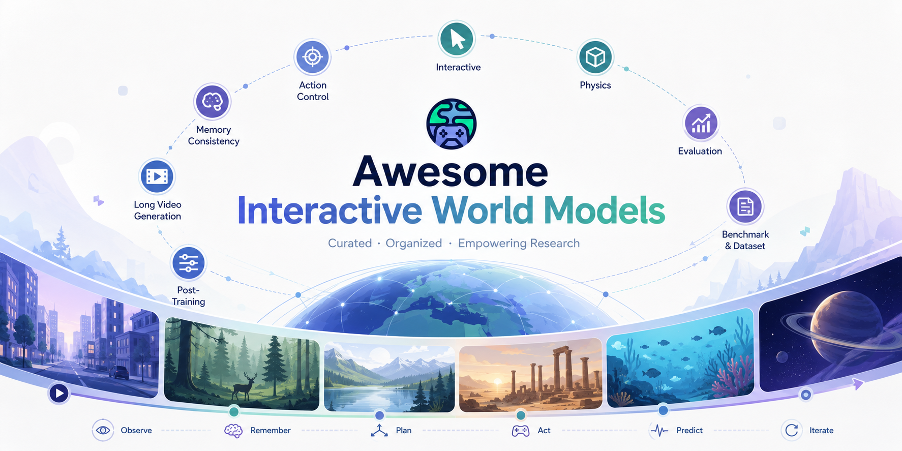

<div align="center">



**📜 Interactive World Model papers organized by core research challenges.** </br>
👉 **Recommended: View the [paper list on our website](https://easontut.github.io/Awesome-Interactive-World-Model/) for a better browsing experience.**
</div>

---
<table align="center" width="100%" border="0" cellspacing="0" cellpadding="0" style="border:none;">
  <tr>
    <td align="center" style="border:none;">🌟 <b>Classic</b></td>
    <td align="center" style="border:none;">✅ <b>Open Source</b></td>
    <td align="center" style="border:none;">❌️ <b>Not Open Source</b></td>
  </tr>
</table>

**Badge Guide.** `🌟` marks representative or category-defining work, with the entire paper entry bolded. `✅` indicates that public resources such as code, data, model weights, demos, or an official project page are available. `❌️` indicates that no public implementation or resource has been found yet. The `[YYYY-MM]` prefix indicates the arXiv submission month when parsed from an arXiv identifier, or a known release/update month for non-arXiv resources.

---
## 🚩 News & Updates
_Major updates and announcements are shown below. Scroll for full timeline._

🔥 **[2026-5] Repository Launch** — Awesome Interactive World Models is now live! We're building a curated collection of Interactive World Model papers, systematically categorized by key research problems. See [CONTRIBUTING.md](CONTRIBUTING.md) for how to contribute.

💡 **[Ongoing] Community Contributions Welcome** — Help us maintain the most up-to-date world models resource! Submit papers via PR or contact us at [email](mailto:yixuanye12@gmail.com).

⭐ **[Ongoing] Support This Project** — If you find this useful, please [cite](#citation) our work and give us a star. Share with your research community!

## 🔥 Recent Paper Updates

[2026-05-29] ✅[Light Interaction: Training-Free Inference Acceleration for Interactive Video World Models](https://arxiv.org/abs/2605.31158)

[2026-05-29] ✅[DecMem: Towards Minute-Long Consistent World Generation with Decoupled Memory](https://arxiv.org/abs/2605.31336)

[2026-05-28] ✅[OmniMem: Scalable and Adaptive Memory Retrieval for Long Video Generation](https://arxiv.org/abs/2605.30519)

**[2026-05-28] ✅🌟(Full-stack open-source real-time interactive video world model framework)[minWM: A Full-Stack Open-Source Framework for Real-Time Interactive Video World Models](https://arxiv.org/abs/2605.30263)**

[2026-05-28] ✅[VideoMLA: Low-Rank Latent KV Cache for Minute-Scale Autoregressive Video Diffusion](https://arxiv.org/abs/2605.30351)

[2026-05-28] ✅[AdaState: Self-Evolving Anchors for Streaming Video Generation](https://arxiv.org/abs/2605.30349)

[2026-05-28] ❌️[Future Forcing: Future-aware Training-free KV Cache Policy for Autoregressive Video Generation](https://arxiv.org/abs/2605.30083)

[2026-05-27] ❌️[Gamma-World: Generative Multi-Agent World Modeling Beyond Two Players](https://arxiv.org/abs/2605.28816)

**[2026-05-25] ✅🌟(Multi-turn interactive world model evaluation)[WBench: A Comprehensive Multi-turn Benchmark for Interactive Video World Model Evaluation](https://arxiv.org/abs/2605.25874)**

[2026-05-25] ✅[E3C: Video Generation with 3D Environmental Memory and Ego-Exo Human Pose Control](https://arxiv.org/abs/2605.26316)

---
## Overview
  - 🔥 [Recent Paper Updates](#recent-paper-updates)
  - 🌐 [General World Model](#general-world-model)
  - 📊 [Benchmark](#benchmark)
  - 💾 [Dataset](#dataset)
  - 🎬 [Long Video Generation](#long-video-generation)
  - 🧠 [Memory Consistency](#memory-consistency)
  - 🎮 [Action Control](#action-control)
  - 🖱️ [Interactive](#interactive)
  - 🔧 [Post-Training](#post-training)
  - ⚙️ [Physics](#physics)
  - 📏 [Evaluation](#evaluation)
  - 📚 [Survey](#survey)
  - 📝 [Citation](#citation)

---

## General World Model

**[2026-05] ✅🌟(Full-stack open-source real-time interactive video world model framework)[minWM: A Full-Stack Open-Source Framework for Real-Time Interactive Video World Models](https://arxiv.org/abs/2605.30263)**

**[2026-01] ✅🌟(Minute-level Memory)[Lingbot-World:Advancing Open-source World Models](https://arxiv.org/abs/2601.20540)**

**[2025-08] ✅🌟(First open-source real-time interactive World Model)[Matrix-game 2.0: An open-source real-time and streaming interactive world model](https://arxiv.org/abs/2508.13009)**

[2026-05] ✅[Light Interaction: Training-Free Inference Acceleration for Interactive Video World Models](https://arxiv.org/abs/2605.31158)

[2026-05] ❌️[Gamma-World: Generative Multi-Agent World Modeling Beyond Two Players](https://arxiv.org/abs/2605.28816)

[2026-05] ✅[SANA-WM: Efficient Minute-Scale World Modeling with Hybrid Linear Diffusion Transformer](https://arxiv.org/abs/2605.15178)

[2026-05] ✅[Warp-as-History: Generalizable Camera-Controlled Video Generation from One Training Video](https://arxiv.org/abs/2605.15182)

[2026-05] ✅[DreamX-World: A General-Purpose Interactive World Model](https://github.com/AMAP-ML/DreamX-World)

[2026-04] ✅[Matrix-Game 3.0: Real-Time and Streaming Interactive World Model with Long-Horizon Memory](https://arxiv.org/abs/2604.08995)

[2026-03] ✅[InSpatio-WorldFM: An Open-Source Real-Time Generative Frame Model](https://arxiv.org/abs/2603.11911)

[2025-12] ✅[Yume-1.5: A Text-Controlled Interactive World Generation Model](https://arxiv.org/abs/2512.22096)

[2025-12] ❌️[RELIC: Interactive Video World Model with Long-Horizon Memory](https://arxiv.org/abs/2512.04040)

[2025-12] ✅[Astra: General Interactive World Model with Autoregressive Denoising](https://arxiv.org/abs/2512.08931)

[2025-12] ✅[HY-World 1.5: A Systematic Framework for Interactive World Modeling with Real-Time Latency and Geometric Consistency](https://3d-models.hunyuan.tencent.com/world/world1_5/HYWorld_1.5_Tech_Report.pdf)

[2025-11] ❌️[Hunyuan-GameCraft-2: Instruction-following Interactive Game World Model](https://arxiv.org/abs/2511.23429)

[2025-11] ❌️[PAN: A World Model for General, Interactable, and Long-Horizon World Simulation](https://arxiv.org/abs/2511.09057)

[2025-11] ✅[MagicWorld: Towards Long-Horizon Stability for Interactive Video World Exploration](https://arxiv.org/abs/2511.18886)

[2025-08] ❌️[Yan: Foundational Interactive Video Generation](https://arxiv.org/abs/2508.08601)

[2025-07] ✅[Yume: An Interactive World Generation Model](https://arxiv.org/abs/2507.17744)

[2025-06] ✅[Matrix-Game: Interactive World Foundation Model](https://arxiv.org/abs/2506.18701)

[2025-06] ✅[Hunyuan-GameCraft: High-dynamic Interactive Game Video Generation with Hybrid History Condition](https://arxiv.org/abs/2506.17201)

[2024-02] ❌️[Genie: Generative Interactive Environments](https://arxiv.org/abs/2402.15391)


## Benchmark

**[2026-05] ✅🌟(Multi-turn interactive world model evaluation)[WBench: A Comprehensive Multi-turn Benchmark for Interactive Video World Model Evaluation](https://arxiv.org/abs/2605.25874)**

**[2026-02] ✅🌟(First Open Domain Memory & Action Benchmark)[MIND: Benchmarking Memory Consistency and Action Control in World Models](https://arxiv.org/abs/2602.08025)**

[2025-05] ✅[Toward Memory-Aided World Models: Benchmarking via Spatial Consistency](https://arxiv.org/abs/2505.22976)

[2025-04] ✅[WorldScore: A Unified Evaluation Benchmark for World Generation](https://arxiv.org/abs/2504.00983)

[2025-02] ✅[WorldModelBench: Judging Video Generation Models As World Models](https://arxiv.org/abs/2502.20694)

[2024-10] ✅[WorldSimBench: Towards Video Generation Models as World Simulators](https://arxiv.org/abs/2410.18072)


## Dataset

[2026-03] ✅ [WildWorld: A Large-Scale Dataset for Dynamic World Modeling with Actions and Explicit State toward Generative ARPG](https://arxiv.org/abs/2603.23497)

[2025-09] ✅ [SpatialVID: A Large-Scale Video Dataset with Spatial Annotations](https://arxiv.org/abs/2509.09676)

[2025-09] ✅ [OmniWorld: A Multi-Domain and Multi-Modal Dataset for 4D World Modeling](https://arxiv.org/abs/2509.12201)

[2025-06] ✅ [Sekai: A Video Dataset towards World Exploration](https://arxiv.org/abs/2506.15675)

[2024-11] ✅ [GameGen-X: Open-World Video Game Dataset](https://arxiv.org/abs/2411.00769)

## Long Video Generation
**[2026-05] ✅ 🌟(First architecture supporting arbitrary step OPD) [AnyFlow: Any-Step Video Diffusion Model with On-Policy Flow Map Distillation](https://arxiv.org/abs/2605.13724)**

**[2026-02] ✅🌟(ODE perspective)[Causal Forcing: Autoregressive Diffusion Distillation Done Right for High-Quality Real-Time Interactive Video Generation](https://arxiv.org/abs/2602.02214)**

**[2025-12] ❌️🌟(Compression recovery training)[Pretraining Frame Preservation in Autoregressive Video Memory Compression](https://arxiv.org/abs/2512.23851)**

**[2025-10] ❌️🌟(Solves Self-Forcing issues)[Self-Forcing++: Towards Minute-Scale High-Quality Video Generation](https://arxiv.org/abs/2510.02283)**

**[2025-08] ❌️🌟(Learnable sparse attention routing)[Mixture of Contexts for Long Video Generation](https://arxiv.org/abs/2508.21058)**

**[2025-06] ✅🌟(DMD perspective)[Self Forcing: Bridging the Train-Test Gap in Autoregressive Video Diffusion](https://arxiv.org/abs/2506.08009)**

**[2025-04] ✅🌟(Context compression)[Frame Context Packing and Drift Prevention in Next-Frame-Prediction Video Diffusion Models](https://arxiv.org/abs/2504.12626)**

**[2024-12] ✅🌟(Teacher->Student acceleration)[From Slow Bidirectional to Fast Autoregressive Video Diffusion Models](https://arxiv.org/abs/2412.07772v4)**

**[2024-07] ✅🌟(Training techniques)[Diffusion Forcing: Next-token Prediction Meets Full-Sequence Diffusion](https://arxiv.org/abs/2407.01392)**

[2026-05] ✅[DecMem: Towards Minute-Long Consistent World Generation with Decoupled Memory](https://arxiv.org/abs/2605.31336)

[2026-05] ✅[VideoMLA: Low-Rank Latent KV Cache for Minute-Scale Autoregressive Video Diffusion](https://arxiv.org/abs/2605.30351)

[2026-05] ✅[AdaState: Self-Evolving Anchors for Streaming Video Generation](https://arxiv.org/abs/2605.30349)

[2026-05] ❌️[Future Forcing: Future-aware Training-free KV Cache Policy for Autoregressive Video Generation](https://arxiv.org/abs/2605.30083)

[2026-05] ✅[Q-ARVD: Quantizing Autoregressive Video Diffusion Models](https://arxiv.org/abs/2605.21072)

[2026-05] ❌️[DySink: Dynamic Frame Sinks for Autoregressive Long Video Generation](https://arxiv.org/abs/2605.21028)

[2026-05] ✅[FlowLong: Inference-time Long Video Generation via Manifold-constrained Tweedie Matching](https://arxiv.org/abs/2605.20910)

[2026-05] ✅[LongLive-2.0: An NVFP4 Parallel Infrastructure for Long Video Generation](https://arxiv.org/abs/2605.18739)

[2026-05] ✅ [Causal Forcing++: Scalable Few-Step Autoregressive Diffusion Distillation for Real-Time Interactive Video Generation](https://arxiv.org/abs/2605.15141)

[2026-03] ✅[Anchor Forcing: Anchor Memory and Tri-Region RoPE for Interactive Streaming Video Diffusion](https://arxiv.org/html/2603.13405v1)

[2026-02] ✅[Context Forcing: Consistent Autoregressive Video Generation with Long Context](https://arxiv.org/abs/2602.06028)

[2026-02] ✅[Latent Forcing: Reordering the Diffusion Trajectory for Pixel-Space Image Generation](https://arxiv.org/abs/2602.11401)

[2026-02] ❌️[Mode Seeking meets Mean Seeking for Fast Long Video Generation](https://arxiv.org/abs/2602.24289)

[2026-02] ❌️[LIVE: Long-horizon Interactive Video World Modeling](https://arxiv.org/abs/2602.03747)

[2026-02] ✅[Rolling Sink: Bridging Limited-Horizon Training and Open-Ended Testing in Autoregressive Video Diffusion](https://arxiv.org/abs/2602.07775)

[2026-02] ❌️[LIGHT FORCING: Accelerating Autoregressive Video Diffusion via Sparse Attention](https://arxiv.org/abs/2602.04789)

[2026-02] ✅[Pathwise Test-Time Correction for Autoregressive Long Video Diffusion Models](https://arxiv.org/abs/2602.05871)

[2025-12] ✅[Reward Forcing: Efficient Streaming Video Generation with Rewarded Distribution Matching Distillation](https://arxiv.org/abs/2512.04678)

[2025-12] ✅[VideoSSM: Autoregressive Long Video Generation with Hybrid State Space Memory](https://arxiv.org/abs/2512.04519)

[2025-09] ✅[Rolling Forcing: Autoregressive Long Video Diffusion in Real Time](https://arxiv.org/abs/2509.25161)

[2025-09] ✅[LongLive: Real-time Interactive Long Video Generation](https://arxiv.org/abs/2509.22622)

[2025-03] ✅[FAR: Frame Autoregressive Model for Both Short- and Long-Context Video Modeling](https://arxiv.org/abs/2503.19325)

[2025-03] ✅[NOVA: Autoregressive Video Generation without Vector Quantization](https://arxiv.org/abs/2503.18723)

[2024-10] ✅[Progressive Autoregressive Video Diffusion Models](https://arxiv.org/abs/2410.08151)

## Memory Consistency

*   ### Static Memory
    

**[2026-02] ✅🌟(w/o Pose Memory)[Infinite-World: Scaling Interactive World Models to 1000-Frame Horizons via Pose-Free Hierarchical Memory](https://arxiv.org/abs/2602.02393)**

**[2025-06] ❌️🌟(w/ Pose FOV overlap retrieval Memory)[Context as Memory: Scene-Consistent Interactive Long Video Generation with Memory Retrieval](https://arxiv.org/abs/2506.03141)**

[2026-05] ✅[OmniMem: Scalable and Adaptive Memory Retrieval for Long Video Generation](https://arxiv.org/abs/2605.30519)

[2026-05] ✅[E3C: Video Generation with 3D Environmental Memory and Ego-Exo Human Pose Control](https://arxiv.org/abs/2605.26316)

[2026-05] ✅[WorldKV: Efficient World Memory with World Retrieval and Compression](https://arxiv.org/abs/2605.22718)

[2026-03] ❌️[MosaicMem: Hybrid Spatial Memory for Controllable Video World Models](https://arxiv.org/abs/2603.17117)

[2026-02] ✅[AnchorWeave: World-Consistent Video Generation with Retrieved Local Spatial Memories](https://arxiv.org/abs/2602.14941)

[2026-01] ✅[StableWorld: Towards Stable and Consistent Long Interactive Video Generation](https://arxiv.org/abs/2601.15281)

[2025-10] ❌️[Memory Forcing: Spatio-Temporal Memory for Consistent Scene Generation on Minecraft](https://arxiv.org/abs/2510.03198)

[2025-06] ✅[VMem: Consistent Interactive Video Scene Generation with Surfel-Indexed View Memory](https://arxiv.org/abs/2506.18903)

[2025-06] ❌️[Video World Models with Long-term Spatial Memory](https://arxiv.org/abs/2506.05284)

[2025-06] ✅[DeepVerse: 4D Autoregressive Video Generation as a World Model](https://arxiv.org/abs/2506.01103)

[2025-05] ✅[Learning World Models for Interactive Video Generation](https://arxiv.org/abs/2505.21996)

[2025-04] ✅[WorldMem: Long-term Consistent World Simulation with Memory](https://arxiv.org/abs/2504.12369)

*   ### Dynamic Memory
    

**[2026-03] ✅🌟(First out-of-view Event Dynamic Memory)[LiveWorld: Simulating Out-of-Sight Dynamics in Generative Video World Models](https://arxiv.org/abs/2603.07145)**

**[2026-02] ✅🌟(First multiplayer Minecraft World Model)[Solaris: Building a Multiplayer Video World Model in Minecraft](https://arxiv.org/abs/2602.22208)**

**[2026-01] ✅🌟(First out-of-view Dynamic Memory)[Flow Equivariant World Models: Structured Dynamics Outside the Field of View](https://arxiv.org/abs/2601.01075)**

[2026-05] ❌️[Teaching Video Generators to Remember: Eliciting Dynamic Memory for Out-of-Sight State Evolution](https://arxiv.org/abs/2605.25333)

[2026-04] ✅[MultiWorld: Scalable Multi-Agent Multi-View Video World Models](https://arxiv.org/abs/2604.18564)

[2026-03] ✅[Out of Sight but Not Out of Mind: Hybrid Memory for Dynamic Video World Models](https://arxiv.org/pdf/2603.25716)

## Action Control

**[2026-02] ✅🌟(Transferable skills)[Olaf-World: Orienting Latent Actions for Video World Modeling](https://arxiv.org/abs/2602.10104)**

**[2025-03] ✅🌟(No longer limited to fixed controls)[AdaWorld: Learning Adaptable World Models with Latent Actions](https://arxiv.org/abs/2503.18938)**

**[2025-01] ❌️🌟(Action control from games)[GameFactory: Creating New Games with Generative Interactive Videos](https://arxiv.org/abs/2501.08325)**

[2026-05] ✅[E3C: Video Generation with 3D Environmental Memory and Ego-Exo Human Pose Control](https://arxiv.org/abs/2605.26316)

[2026-05] ✅[SCOPE: Simulating Cross-game Operations in Playable Environments for FPS World Models](https://arxiv.org/abs/2605.23345)

[2026-05] ✅[ReactiveGWM: Steering NPC in Reactive Game World Models](https://arxiv.org/abs/2605.15256)

## Interactive

**[2025-12] ✅🌟(Edit objects: add/remove/recolor)[Spatia: Video Generation with Updatable Spatial Memory](https://arxiv.org/abs/2512.15716)**

**[2025-11] ❌️🌟(Text interaction: spawn weapons, affect environment)[Hunyuan-GameCraft-2: Instruction-following Interactive Game World Model](https://arxiv.org/abs/2511.23429)**


## Post-Training

[2026-04] ✅[World-R1: Reinforcing 3D Constraints for Text-to-Video Generation](https://arxiv.org/abs/2604.24764)

[2026-02] ✅[WorldCompass: Reinforcement Learning for Long-Horizon World Models](https://arxiv.org/abs/2602.09022)

[2025-05] ✅[RLVR-World: Training World Models with Reinforcement Learning](https://arxiv.org/abs/2505.13934)


## Physics
[2026-03] ✅[RealWonder: Real-Time Physical Action-Conditioned Video Generation](https://arxiv.org/abs/2603.05449)

## Evaluation
[2026-03] ✅[Interactive World Simulator for Robot Policy Training and Evaluation](https://arxiv.org/abs/2603.08546)

## Survey
**[2026-04] ✅🌟(Defines advanced world models around perception, interaction, and long-term memory, and introduces OpenWorldLib as a unified inference framework.) [OpenWorldLib: A Unified Codebase and Definition of Advanced World Models](https://arxiv.org/abs/2604.04707)**

[2026-05] ❌️[World Action Models: The Next Frontier in Embodied AI](https://arxiv.org/abs/2605.12090)

[2026-03] ❌️[Video Generation Models as World Models: Efficient Paradigms, Architectures and Algorithms](https://arxiv.org/abs/2603.28489)

## Others
[2025-05] ✅[Vid2World: Crafting Video Diffusion Models to Interactive World Models](https://arxiv.org/abs/2505.14357)

----
## Citation
If you find this repository useful, please consider citing this list:
```bash
@misc{ye2026awesomeiwm,
    title = {Awesome-Interactive-World-Model},
    author = {Yixuan Ye and Ruiqi Wu},
    journal = {GitHub repository},
    url = {https://github.com/EasonTuT/Awesome-Interactive-World-Model},
    year = {2026},
}
```
